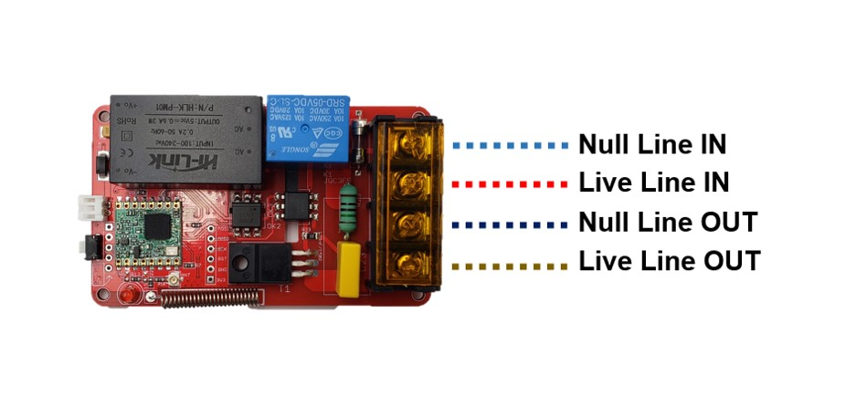
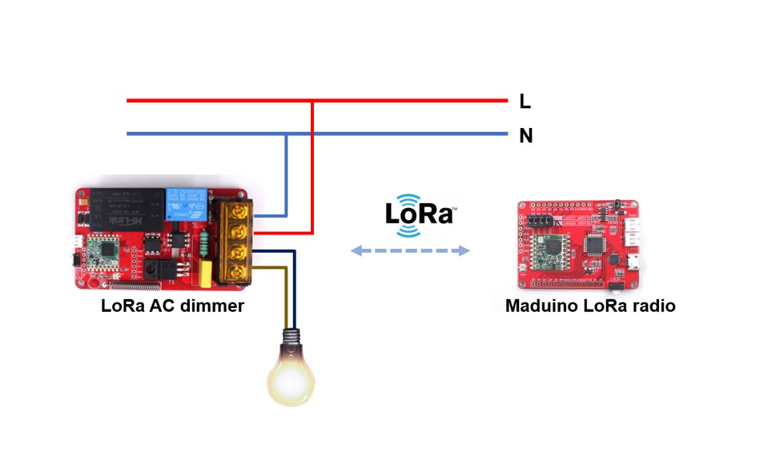

# Makerfabs Lora Node: AC Dimmer

```c++
/*
Version:		V1.1
Author:			Vincent
Create Date:	2021/7/31
Note:
	2021/8/6 V1.1:Change firmware position.
	2022/4/2 V1.2:Move to Malora porject
	
*/
```


[toc]

# Makerfabs

[Makerfabs home page](https://www.makerfabs.com/)

[Makerfabs Wiki](https://makerfabs.com/wiki/index.php?title=Main_Page)


# Makerfabs Lora AC Dimmer

## Intruduce

AC dimmer is designed to control the alternating current voltage, it is used to control the LED light, electronic heating element and the AC motor. LoRa AC Dimmer module is based on Atmel's Atmega328P to control the dimmer through the PWM signal the MCU generated. The board also features the LoRa module on board that provides a solution for controlling remotely.

This is a special module that Makerfabs had burned the firmware to it before shipping. After receiving the package, it can be controlled to turn on or off, or turn the output by 35% through the Specific command, and it does not require additional programming.

Product Link ：[Lora AC Dimmer](https://www.makerfabs.com/lora-ac-dimmer.html?search=ac%20dimmer)

Wiki Link :  [LoRa_AC_Dimmer](https://www.makerfabs.com/wiki/index.php?title=LoRa_AC_Dimmer) 

## Feature

- ATMEL Atmega328P: High Performance, Low Power Atmel®AVR® Classic Microcontroller
- Speed Grade: 20Mhz
- Flash: 32KBytes
- RAM: 2KBytes
- EEPROM: 1Kbytes
- Onboard LoRa module
- Photocoupler, 400V peak off-state voltage
- With integrated Phase detection and Zero Crossing Detection processing
- 5V Relay for shutting off absolutely
- Fuse with 250V and 1.5A

### Front:





# Command

## Lora Node Massage

```c
Type ID: 00
Short name: DIMMER
```
## Action

| ACT  | PARAM             | Description          |
| ---- | ----------------- | -------------------- |
| 114  | 000000(not parse) | Querying node status |
| 000  | 000000(not parse) | Close Dimmer and cut relay   |
| 001  | 000000(not parse) | All open Dimmer and relay      |
| 002  | 000XXX            | Set dimmer's phase cutting  |
| 003 | XXXXXX | Set dimmer's phase cutting in seconds and then open the dimmer. |
| 004 | XXXXXX | Set dimmer's phase cutting in seconds and then all close the dimmer. |
|  |  |  |


Command example:

```c
ACT = 0 Close
	ID000123ACT000PARAM000000

ACT = 1 All Open
	ID000123ACT001PARAM000000

ACT = 2 Control 
	Phase cutting : PARAM % 1000 (0-255)
    ID000123ACT002PARAM000051
	//Set dimmer's phase cutting to 51/255(20%) which named ID000123.
    
ACT = 3 Control Then All ON 
	Phase cutting : PARAM % 1000 (0-255)
	Delay time (second) : PARAM / 1000 (0-999)
    ID000123ACT003PARAM005060
	//Set dimmer's phase cutting to 60/225 which named ID000123. 
    //And all open after 5 seconds.
        
ACT = 4 Control Then All OFF 
	Phase cutting : PARAM % 1000 (0-255)
	Delay time (second) : PARAM / 1000 (0-999)
    ID000123ACT004PARAM005060
	//Set dimmer's phase cutting to 60/225 which named ID000123. 
    //And all close after 5 seconds.
    
```


- ACT 001: All on.


- ACT 002: 51/255(20%)


## Reply

The reply format is as follows:

```c
ID00XXXX[space]REPLY[space]:[space]DIMMER[space][Relay Status]
```

Spaces cannot be omitted.