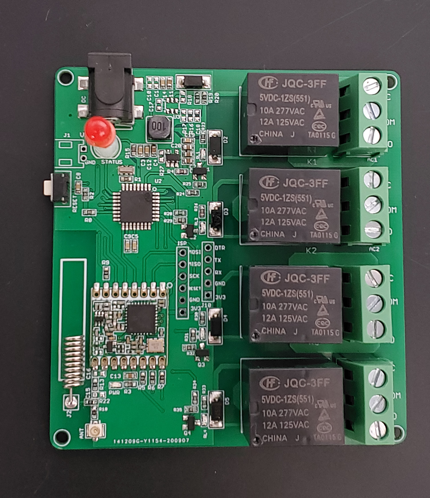

 Makerfabs Lora Node：Lora Relay 4Channel
 ==


```
/*
Version:		V1.0
Author:			Vincent
Create Date:	2022/3/23
Note:
	
*/
```



[toc]

# Makerfabs

[Makerfabs home page](https://www.makerfabs.com/)

[Makerfabs Wiki](https://makerfabs.com/wiki/index.php?title=Main_Page)


# Introduce

4-Channel Lora Relay-10A based on the Arduino, users can program it with Arduino IDE, which is very easy especially suit for the none-programmers. There are also guide for users to learn how to create the first IoT project with this board, with which the starters can learn the hardware and programming skill quickly. 

Product Link ：[4-Channel Lora Relay 10A](https://www.makerfabs.com/4-channel-lora-relay-10a.html)

Wiki Link : [Lora Relay 4Channel](https://www.makerfabs.com/wiki/index.php?title=4-Channel_Lora_Relay-10A)


## Feature

* ATMEL Atmega328P: High Performance, Low Power Atmel®AVR® 8-Bit Microcontroller
* Speed Grade:20Mhz
* Flash:32Kbytes
* RAM: 2KBytes
* EEPROM: 1Kbytes
* Relay type: General Purpose 
* Rated current of relay contact: 10A
* Coil type of relay: Non Latching
* Coil voltage of relay: 5V
* Switching voltage of relay: (277VAC , 28VDC) Max
* DC12V or 5V input

 ## Pin OUT

Control relay pins: 

|Atmega328P	|Relay |
|---|---|
|D4	|K1 |
|D3	|K2 |
|A3	|K3 |
|A2	|K4 |


# Command

## Lora Node Massage

```c
Type ID: 03
Short name: RELAY4
```

## Action

| ACT  | PARAM             | Description          |
| ---- | ----------------- | -------------------- |
| 114  | 000000(not parse) | Querying node status |
| 000  | 000000(not parse) | Close all relay      |
| 001  | 000000(not parse) | Open all relay       |
| 002  | 00XXXX            | Set 4 channel relay  |

Command example:

```c
ACT = 0 Close
  ID001ACT000PARAM000000

ACT = 1 All Open
  ID001ACT001PARAM000000

ACT = 2 Control 
  PARAM = 0000-1111 Relay Status
  ID001ACT002PARAM001010
```


## Reply

The reply format is as follows:

```c
ID03XXXX[space]REPLY[space]:[space]RELAY4[space][Relay Status]
    
ID030001 REPLY : RELAY4 0101
```

Spaces cannot be omitted.

