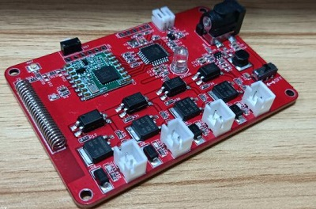
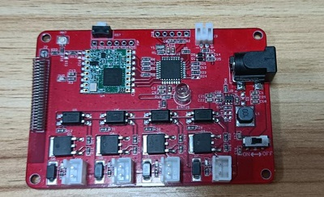
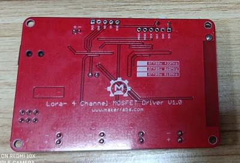

 Makerfabs Lora Node：Lora- 4 Channel MOSFET Driver
 ==


```
/*
Version:		V1.0
Author:			Vincent
Create Date:	2022/3/24
Note:
				2022/4/2	V1.1: Fix readme bug, fix code pin
*/
```



[toc]

# Makerfabs

[Makerfabs home page](https://www.makerfabs.com/)

[Makerfabs Wiki](https://makerfabs.com/wiki/index.php?title=Main_Page)


# Introduce

4-Channel Lora MOSFET based on the Arduino, users can program it with Arduino IDE, which is very easy especially suit for the none-programmers. There are also guide for users to learn how to create the first IoT project with this board, with which the starters can learn the hardware and programming skill quickly. 

Product Link ：[]()

Wiki Link : []()


## Feature

* ATMEL Atmega328P: High Performance, Low Power Atmel®AVR® 8-Bit Microcontroller
* Speed Grade:20Mhz
* Flash:32Kbytes
* RAM: 2KBytes
* EEPROM: 1Kbytes
* Rated current of relay contact: 10A ???
* Coil type of relay: Non Latching
* Coil voltage of relay: 5V
* Switching voltage of relay: (277VAC , 28VDC) Max ???
* DC12V input


### Front







 ## Pin OUT

Control relay pins: 

| Atmega328P | MOS  |
| ---------- | ---- |
| D5         | K1   |
| D6         | K2   |
| D9         | K3   |
| D3         | K4   |


# Command

## Lora Node Massage

```c
Type ID: 06
Short name: MOS4
```

## Action

| ACT  | PARAM             | Description          |
| ---- | ----------------- | -------------------- |
| 114  | 000000(not parse) | Querying node status |
| 000  | 000000(not parse) | Close all MOS        |
| 001  | 000000(not parse) | Open all MOS         |
| 002  | 00XXXX            | Set 4 channel MOS    |

### ACT 002

The last four digits of PARAM represent the states of the four MOS.  

The status ranges from 0 to 8:

| Status | 0    | 1     | 2    | 3     | 4    | 5     | 6    | 7     | 8    |
| ------ | ---- | ----- | ---- | ----- | ---- | ----- | ---- | ----- | ---- |
| Power  | 0%   | 12.5% | 25%  | 37.5% | 50%  | 62.5% | 75%  | 87.5% | 100% |


Command example:

```c
ACT = 000 Close
	ID060000ACT000PARAM000000
	//Close all mosfet

ACT = 001 All Open
	ID060000ACT001PARAM000000
	//Open all mosfet, 100% power
    
ACT = 002 Control 
	PARAM = 0000-8888 MOS Status	0,1/8,...,7/8,1
	ID060000ACT002PARAM008010
    //Set mos0 100%; mos1 0%; mos2 12.5%;mos3 0%
```


## Reply

The reply format is as follows:

```c
ID06XXXX[space]REPLY[space]:[space]MOS4[space][Mosfet Status]
    
ID060001 REPLY : MOS4 0801
```

Spaces cannot be omitted.